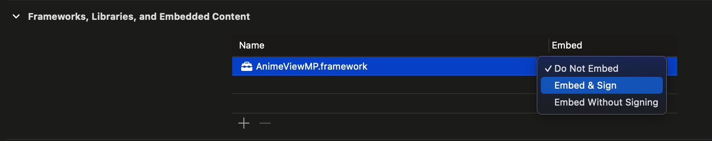

# CourseWork

## Base info
This repository contains my coursework, which I developed during the fourth course of my studies. The aim was to create an efficient real-time inference pipeline framework for iOS using MediaPipe and the Whitebox_Cartoon_GAN model.

## How to run
 1. Get the repo:
    ```shell
    git clone --recursive https://github.com/L3b1n/CourseWork.git 
    ```
 2. Install all the necessary dependencies:
    * Python 3 latest version `brew install python`
    * OpenCV latest version `brew install opencv`
    * Bazel latest version `brew install bazel`  
    You can run just one command:
    ```shell
    brew install python opencv bazel
    ```
 3. Compile the ["build.sh"](./build.sh) script using:
    ```shell
    chmod +x ./build.sh
    ```
 4. Build the iOS framework by runnig the script:
    ```shell
    ./build.sh
    ```
 5. Open the AnimeView project in Xcode, set the created framework to be embedded and signed.
 
 6. Connect yours device and run the project. Enjoy it :)

## Dependencies
 * [mediapipe](https://github.com/google-ai-edge/mediapipe)
